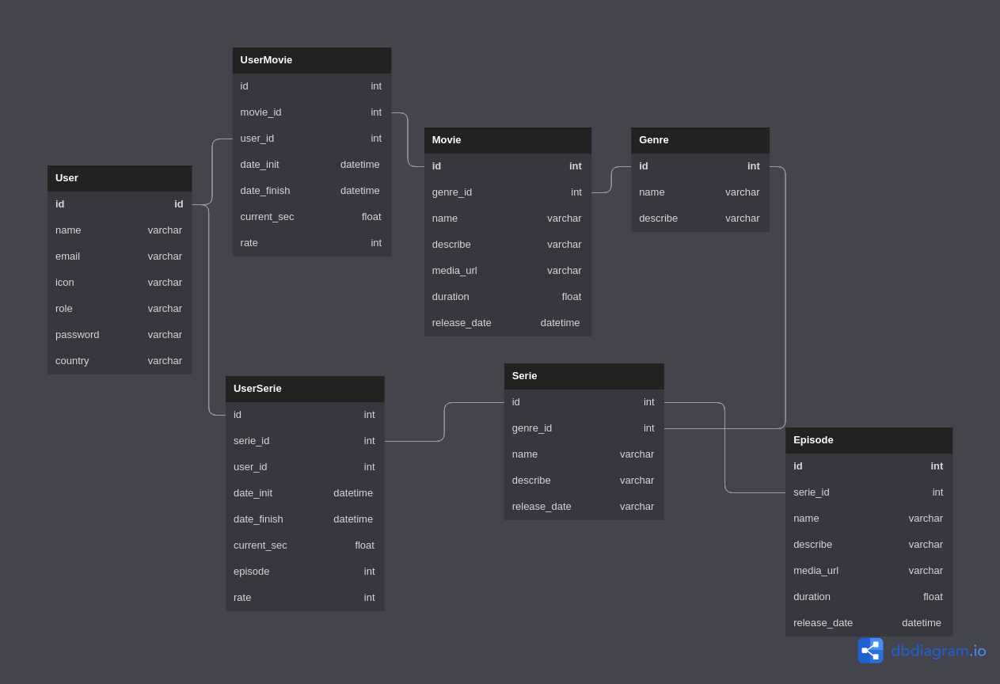

<h1 align="center">
📄 OMNI API
</h1>

## Sobre o projeto

---
## Diagrama de banco de dados

---

## ☕ Seja um dos contribuidores

Quer fazer parte desse projeto? Clique [AQUI](CONTRIBUTING.md) e leia como contribuir. 

## 🍜 Licença

Esse projeto está sob licença. Veja o arquivo [LICENÇA](LICENSE.md) para mais detalhes. 